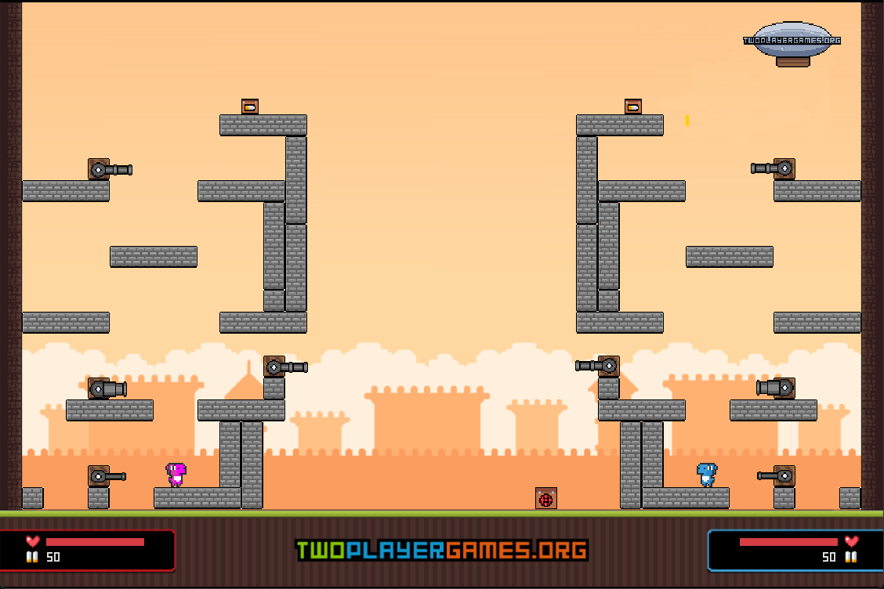

# Janissary Tower Y8 game with the SFML C++ library

## Introduction

Recreate the [Janissary Tower Y8](https://vi.y8.com/games/janissary_tower) game using C++ language and the SFML library.

Most of the game's graphics are captured and extracted by me from the original game. Some of them are self-drawn, while others are sourced from itch.io.

Due to my lack of enthusiasm for physics, the elements in the game will not strictly adhere to the laws of physics. There are also some slight changes to the abilities of certain types of guns (due to the aforementioned reason).

## Video

* **Youtube: https://www.youtube.com/watch?v=Z4cjmzEtQXs**
  
## Requirements

* **SFML 2.5.1**

## Sources

* **Music: https://danosongs.com/**
* **Character:  https://arks.itch.io/dino-characters**
* **Original Game: https://vi.y8.com/games/janissary_tower**
